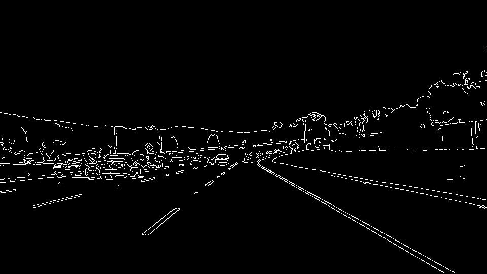
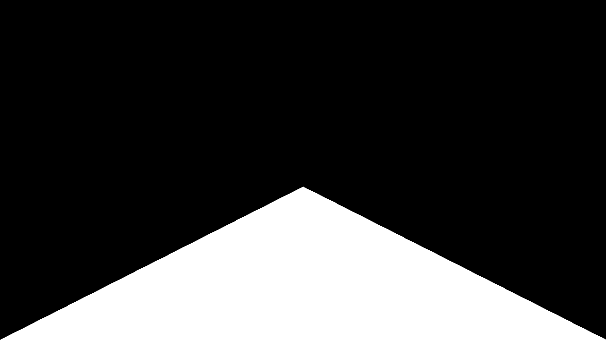
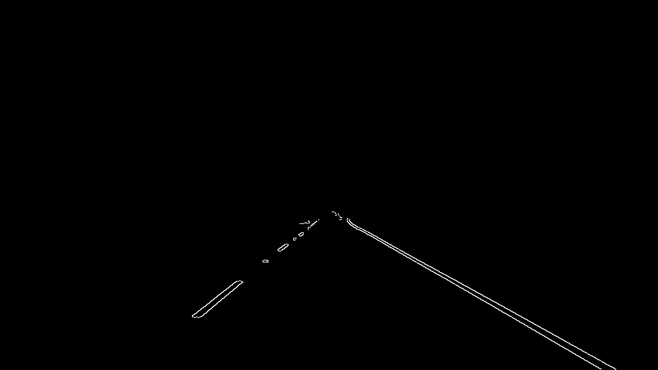
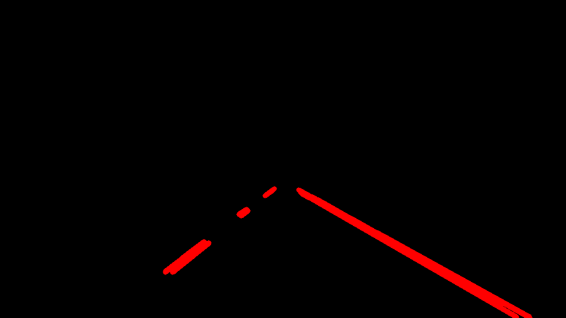
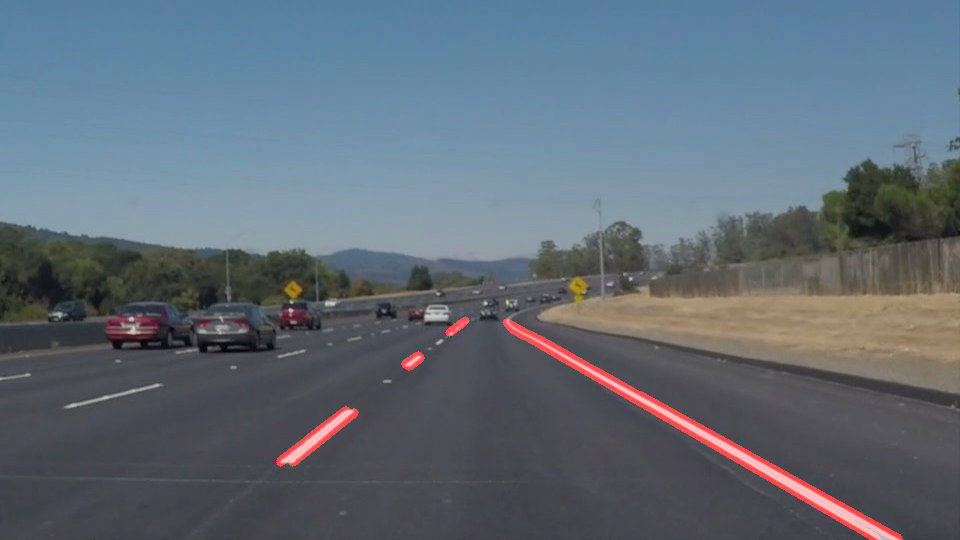
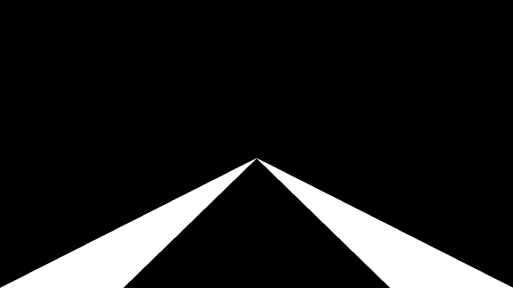
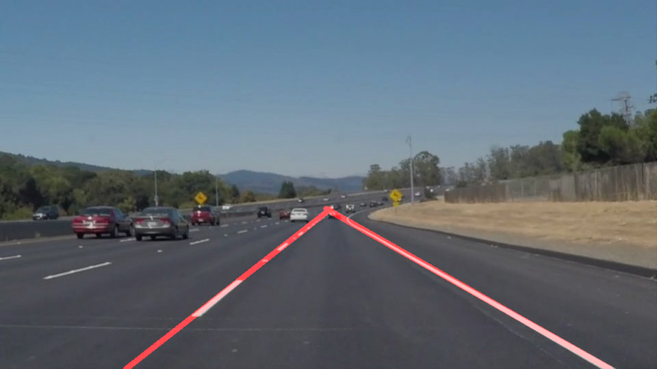

# **Finding Lane Lines on the Road** 
### Introduction
This project marks left & right lane lines in a given input video of first-person view of a car travelling on a road.

---

**Finding Lane Lines on the Road**

The general solution behind finding lane lines is to make use of computer-vision techniques to detect edges in the image & apply further filters to focus on the edges we are interested in(lane lines). The CV algorithms we make use of are:

- Canny Algorithm for edge detection
- Hough Transformation to detect lines from the edges

---

### 1. Solution Pipeline
My pipeline consists of the following steps. Each step takes its input from previous step:-
1. Convert input image to grayscale
2. Apply Gaussian blur
3. Apply canny edge detection

4. Apply region of interest mask

Region of Interest(ROI) is the triangle extending from center to the bottom left & right corners.

 

After overlaying the ROI on the canny output we get.

 

5. Apply hough transform

6. Overlay the above image on the original image.

This will result in the below final image.

### 2. Improvements to the pipeline
We can think of an immediate improvement to the pipeline. Why not improve the region of interest mask? As we are only interested in the lane lines, we don't have to consider the central region of the triangle. Hence the ROI can be further trimmed down to the below.

 

This has the immediate effect of filtering out the noise in between the lane lines.(This will help us with the challenge video later)

Another improvement can be to join the multiple lane line-segments into a single line. To do this we have to improve the draw_lines function. The insight that I arrived at is as follows.

- The slope of the left lane line is always +ve. Slope of right lane line is -ve
- slope of the left lane line is > slope of line joining the center & bottom-left corner
- slope of the right lane line is < slope of line joining the center & bottom-right corner

These observations allow us to formulate the solution as shown below.

- Group the total line segments in the image into two groups according to the criteria above.
- Fit a line equation to each group using np.polyfit
- end-points of left lane are intersection points of left-line eqn with the horizontals passing through the center & bottom border
- end-points of right lane are intersection points of right-line eqn with the horizontals passing through the center & bottom border
- Draw the left & right lanes from their end-points using cv2.drawlines function

After applying the above improvements into our pipeline, we get the final ouput image as shown below.

### 3. Possible future improvements to the pipeline

The disadvantage with our pipeline is immediately obvious. We experience some of the problems in the challenge portion of the project. When the image has strong shadows and bright light on the road, differentiating between lane lines & other noise becomes difficult.

Also when we are experiencing sharp turns on the road, we are actually looking at lane curves instead of lane lines. Hence we could experiment with fitting a polynomial to the lanes instead of a line.
